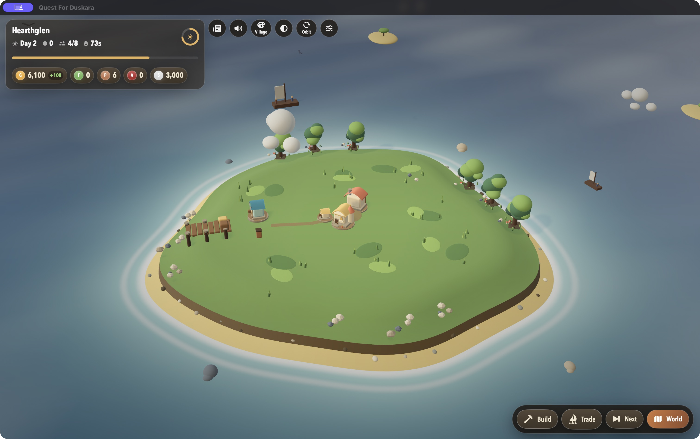
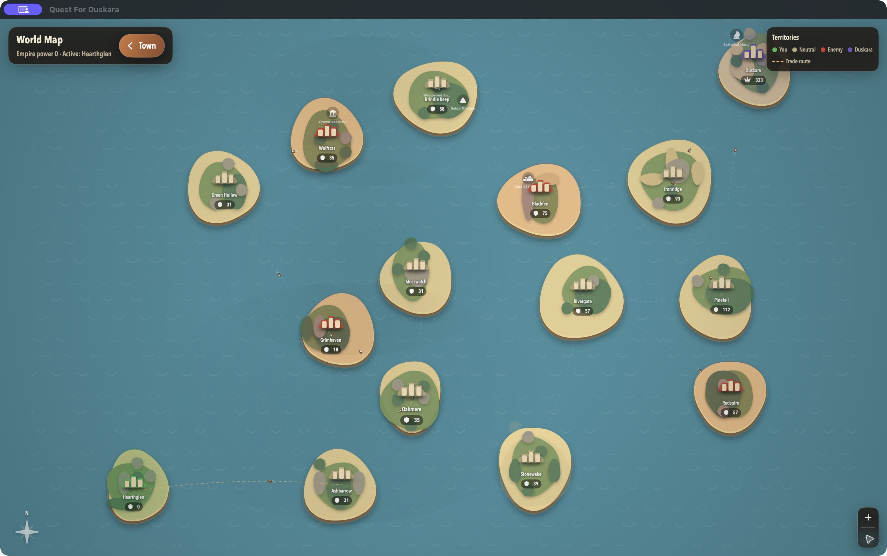
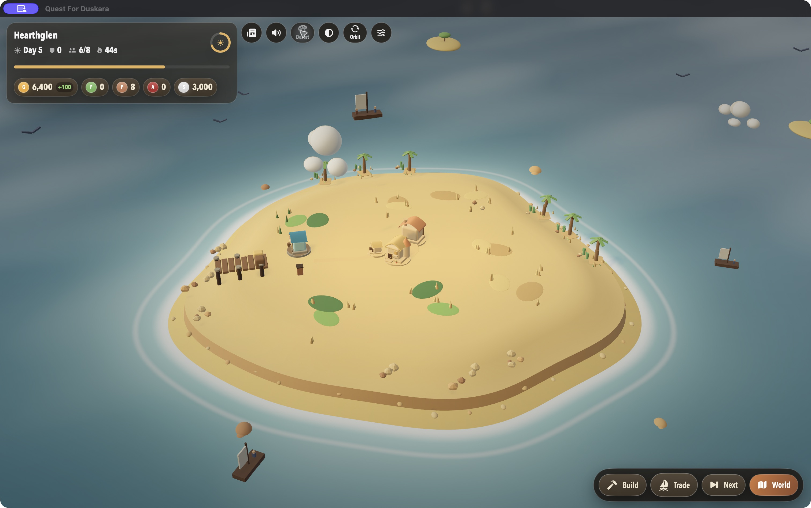
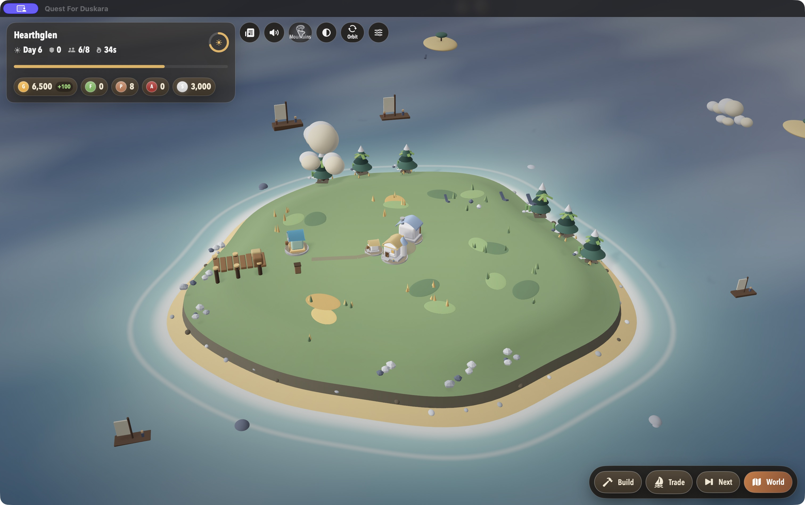
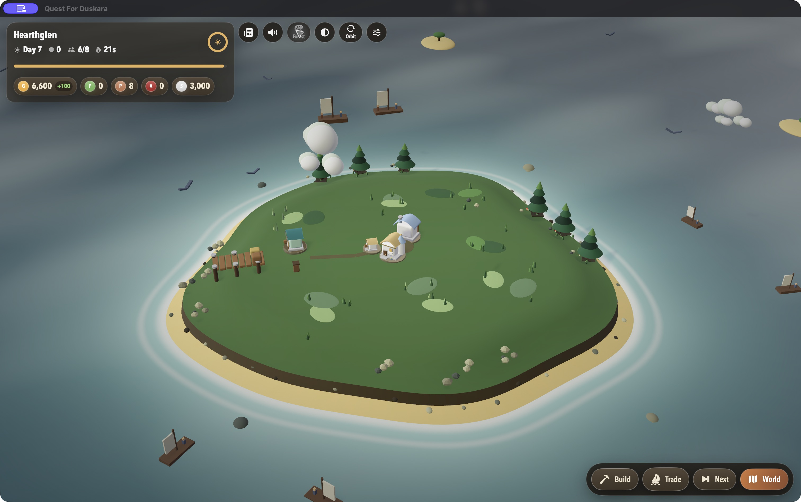

# Quest for Duskara

**Build a foothold. Sail the archipelago. Take Duskara.**

Quest for Duskara is a single-player strategy game for macOS. You begin with one small island town in a world of fifteen. Build an economy, feed and train an army, trade with free cities, and capture islands on the way to Duskara's stronghold. The other factions keep growing while you decide what to do next.



## The game

- **Build your town:** place and upgrade Houses, Farms, Factories, Piers, and Barracks on a 3 × 3 board.
- **Make each day count:** a day passes every ten seconds. Buildings produce resources, soldiers eat, and enemy cities prepare their next move.
- **Trade or conquer:** use the Harbor Market for food and skill, or sail from the world map to attack another city.
- **Grow an empire:** captured towns share gold, food, and skill, while their soldiers remain stationed locally. Move troops between islands as your front line shifts.
- **Choose your challenge:** Easy, Medium, and Hard change your starting stockpile. The campaign ends when you capture Duskara or lose your last town.



The town has four visual themes. They change the look of your island, not the rules of the campaign.

| Village | Desert |
| --- | --- |
|  |  |
| Mountains | Forest |
|  |  |

[See more v0.02 screenshots](Screenshots/v0.02), including [building levels](Screenshots/v0.02/house-level-1.jpg) and the [Harbor Market](Screenshots/v0.02/harbor-market.jpg).

## Play

Quest for Duskara currently targets **macOS 26 or later**. Check [Releases](https://github.com/Dbhardwaj99/Quest-For-Duskara/releases) for packaged builds, or build the game from source:

```bash
git clone https://github.com/Dbhardwaj99/Quest-For-Duskara.git
cd Quest-For-Duskara
open "Quest For Duskara.xcodeproj"
```

In Xcode, select the **Quest For Duskara** scheme and **My Mac**, then press **Run** (`⌘R`). This source was built with Xcode 26.6. The game includes a short first-launch tutorial; you can also skip it and start a campaign.

Your first moves: choose a difficulty, build a House for workers, then add a Farm for food and a Factory for skill. Build Barracks when you have enough people to train archers or knights. Open **World** to inspect defenses and launch attacks. **Next** advances a day immediately.

## How I made it

I'm [Divyansh Bhardwaj](https://github.com/Dbhardwaj99). This started as a small Swift town-building prototype and grew into an island campaign. The interface is written in **SwiftUI**; the 3D town uses **RealityKit** and **Metal**; and the rules, economy, combat, world generation, and save system are written in Swift. The coastal buildings are bundled as **USDZ** models. A seeded generator lays out the archipelago, so each campaign has a coherent world to explore.

The code is organized by job: [`Models/`](Models) holds game state and rules, [`ViewModels/`](ViewModels) connects actions to the interface, [`Views/`](Views) draws the game, and [`Tests/`](Tests) checks the campaign loop. If you want to explore or contribute, a small bug report or focused pull request is welcome.

Quest for Duskara is open source under the [MIT License](LICENSE).
